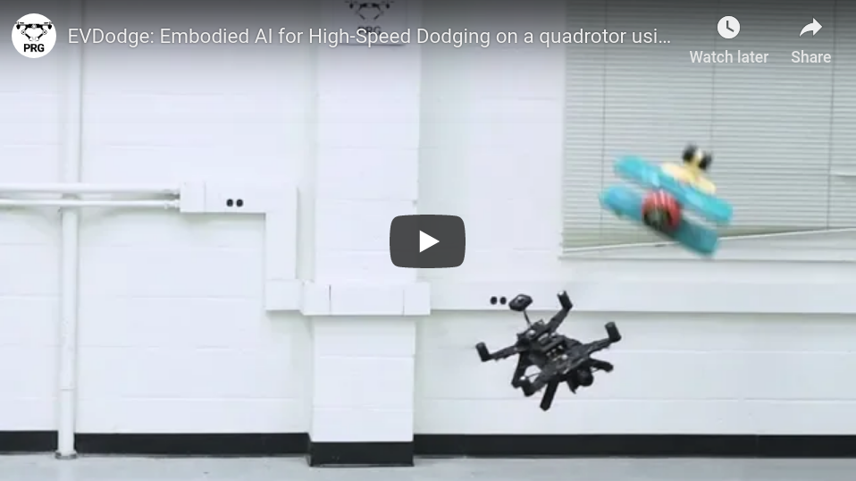

# EVDodgeNet: Deep Dynamic Obstacle Dodging with event cameras
**EVDodge** by <a href="http://prg.cs.umd.edu"><i>Perception & Robotics Group</i></a> at the Department of Computer Science, <a href="https://umd.edu/">University of Maryland- College Park</a> and <a href="http://rpg.ifi.uzh.ch">Robotics & Perception Group</a> at 
<a href="https://www.ifi.uzh.ch/en.html">Department of Informatics</a>, <a href="https://www.uzh.ch/cmsssl/en.html">University of Zurich</a> & <a href="https://www.ethz.ch/en.html">ETH Zurich</a>.


### Code and instruction guidelines will be uploaded here on the acceptance of the paper.

###### Check out our Youtube video which depicts the proposed framework of our bio-inspired perceptual design for quadrotors.
[](https://www.youtube.com/watch?v=k1uzsiDI4hM)

Dynamic obstacle avoidance on quadrotors requires low latency. A class of sensors that are particularly suitable for such scenarios are event cameras. In this paper, we present a deep learning based solution for dodging multiple dynamic obstacles on a quadrotor with a single event camera and onboard computation. Our approach uses a series of shallow neural networks for estimating both the ego-motion and the motion of independently moving objects. The networks are trained in simulation and directly transfer to the real world without any fine-tuning or retraining.


We successfully evaluate and demonstrate the proposed approach in many real-world experiments with obstacles of different shapes and sizes, achieving an overall success rate of 70% including objects of unknown shape and a low light testing scenario. To our knowledge, this is the first deep learning based solution to the problem of dynamic obstacle avoidance using event cameras on a quadrotor. Finally, we also extend our work to the pursuit task by merely reversing the control policy, proving that our navigation stack can cater to different scenarios. 


- [Project Page](https://prg.cs.umd.edu/EVDodge)
- [Paper](https://prg.cs.umd.edu/research/EVDodge_files/EVDodge.pdf)
- [Supplementary](https://prg.cs.umd.edu/research/EVDodge_files/Supplementary-EVDodge.pdf)
- [arXiv Preprint](https://arxiv.org/abs/1906.02919)

## Publication:

```
@inproceedings{Sanket2019EVDodgeEA,
  title={EVDodgeNet: Deep Dynamic Obstacle Dodging with event cameras},
  author={Nitin J. Sanket and Chethan M. Parameshwara and Chahat Deep Singh and Ashwin V. Kuruttukulam and Cornelia Fermuller and Davide Scaramuzza and Yiannis Aloimonos},
  year={2019}
}
```

## License:
Copyright (c) 2019 Perception and Robotics Group (PRG)
